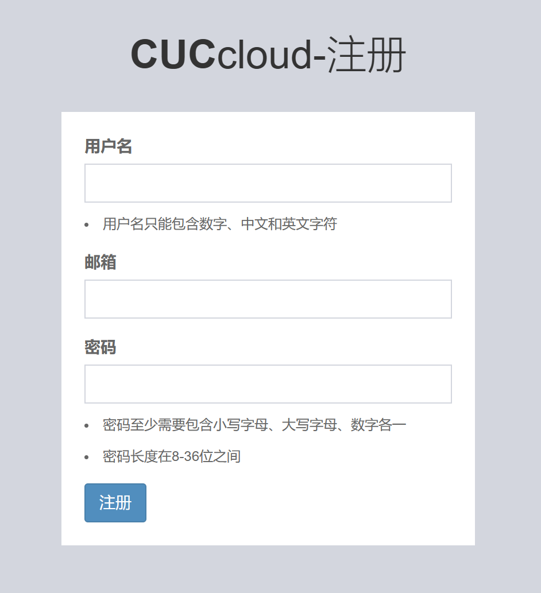

# 个人总结技术报告

## 主要贡献
- 负责项目总体实现及规划项目结构
- 完成《基于网页的用户注册与登录系统》所有要求中基础架构和基础实现（后端）
- 完成《基于网页的文件上传加密与数字签名系统》所有要求（后端）
- 完成《基于网页的加密文件下载与解密》所有要求（后端）
### 项目总体实现及规划项目结构
- 主要参考了[数字内容安全应用实践](https://github.com/anjingcuc/learn_flask_the_hard_way/blob/master/0x09_finished)的结构作为项目基础结构，而功能实现的代码基本参考[ Python 版实现的课程系统半成品源代码 ](https://github.com/TheMasterOfMagic/ac)
- 由于我们最开始是想从零开发，但是我们基本上都是从零学起，所以在我们自己创建的项目上pr了多次后才发觉到已经用了大量的示例代码了，还请老师原谅我们的粗心，没有及时选择fork。


## 技术方面工作
- 设计并实现`注册`功能
- 设计并实现`安全的忘记口令 / 找回密码`功能
- 设计并实现`下载URL设置有效期（限制时间或限制下载次数），过期后禁止访问`功能
- 实现`对于持有加密后的对称密钥的匿名用户，实现客户端对下载后的文件可以解密还原到原始文件`功能

### `注册`功能开发回顾
- 由于对网页开发方面几乎是零经验，所以最初是通过通读安老师小学期给出的示例代码([数字内容安全应用实践](https://github.com/anjingcuc/learn_flask_the_hard_way/blob/master/0x09_finished))初步了解前后端工作模式，并且重点阅读了后端的代码，然后以较为简单的注册功能的实现作为练手，初步了解了后端的工作模式，前后端应该如何连接，以及flask这个web框架模式。
  
- 在此基础上，由`cwycccc`同学完成后续的开发以及完善

### `安全的忘记口令 / 找回密码`功能开发回顾
#### 设计思路
- 首先就是如何验证用户是本人，从而实现**安全地**这个要求，在这里我选择的是使用`邮箱验证`，也就是通过向用户注册时使用的邮箱发送验证码，然后用户通过提交验证码来证明身份，然后客户端提供重设密码的功能
#### 遇到的问题以及解决方案
- Q1.**配置 Flask-Mail 的内容应该如何兼容到现有的框架下？**
- **技术问题描述**：由于我们是继承了[数字内容安全应用实践](https://github.com/anjingcuc/learn_flask_the_hard_way/blob/master/0x09_finished)的架构，所以如何修改架构并配置Flask-Mail以及初始化app实例后能正确传到路由中并使用成了一个问题
- **问题解决过程**：再最初的时候，我直接在`application.py`中配置，并且试图直接通过`from app.application import flask_app`将其导入所使用的路由中，然后在路由所在的`views.py`文件中再通过`Mail(flask_app)`初始化邮箱设置，但是这么做会报错`循环导入（circular import）`。所以我转而选择在`application.py`中直接初始化
   ```python
    # 初始化 Flask-Mail
    mail = Mail(flask_app)

    # 添加 Flask-Mail 作为扩展到 Flask 应用中
    flask_app.extensions['mail'] = mail
  ```

- Q2.**如何保证在进行验证的时候保证验证的唯一性（即不会被非法用户钻空子）**
- **解决思路**：通过在路由上引入变量token和用户邮箱作为唯一标识（隐藏token的任务由`cwycccc`同学完成）
- **技术问题描述**：由于对于前端与后端对接的不熟练，导致前端不能正确识别上述两个变量，错误代码如下：
  ```python
  #后端
  @forgot.route('/verify_email/<token><email>',methods=['GET', 'POST'])
  ```
  ```html
  {#前端#}
   <form action="/forgot/verify_email/<token><email>" method="post">
  ```
- **问题解决过程**：利用chatgpt了解到前后端的变量是如何对接的，更改获得以下代码：
  ```python
  #后端
  @forgot.route('/verify_email/<token>/<email>',methods=['GET', 'POST'])
  ```
  ```html
  {#前端#}
  <form action="/forgot/verify_email/{{ token }}/{{ email }}" method="post">
  ```


### `下载URL设置有效期（限制时间或限制下载次数），过期后禁止访问`功能开发回顾
#### 设计思路
- 如果要实现对文件的有效期限制，则需要对文件本身的属性做一些限制，所以我在文件的数据属性中增加了四个属性，如下：
  ```python
    shared = db.Column(db.Boolean, default=False)
    download_tokens = db.Column(db.String(36),nullable=True)#唯一标识
    expire_time = db.Column(db.Integer,nullable=True)  # 存储时间戳，单位为秒
    max_downloads = db.Column(db.Integer,nullable=True)#最大下载次数
  ```
- 现在来解释一下后面**三个标识的作用**：首先我将`download_tokens`设为可以为空，这样就可以实现每次在共享的时候生成唯一标识，而取消共享的时候`download_tokens`也同时作废，保证了标识的唯一性，防止过往标识泄露造成的安全漏洞；然后是`expire_time`，它的大小代表了文件的有效时间，如果在设置共享的同时将其设为“无限制”，则会被置为`None`，也就是其不再起限制时间的作用，`max_downloads`同理。
- 根据以上特性产生的实现逻辑如下：在点击`进行共享`后，出现弹窗可以来设置`expire_time`以及`max_downloads`，然后将数据传输到后端，后端将为其生成一个具有唯一标识的`download_tokens`，并根据传回来的数据设置该文件的`expire_time`以及`max_downloads`属性并保存在数据库中；当用户在`共享文件`页面中点击`下载`的链接时，后端检测该文件的`download_tokens`是否有效、`expire_time`是否有效或小于当前时间、`max_downloads`是否有效或小于等于0，来决定用户是否可以正常下载该文件。
  
#### 遇到的问题以及解决方案
- Q1.**如何通过合理的规划，基于现有的路由将功能嵌入或者复用函数**
- 其实技术方面没碰到什么大问题，但是如何实现每一个环节能够合理并正确接收数据和传出数据确实花了我一下午去一点点修改尝试，然后一步步构建出了完整的逻辑，在几乎没修改原来就有的代码前提下完成了嵌入（特别感谢负责前端的`XTEL-Puppy`同学能够将前端弹窗的参数正确的传递给我）。


## 印象深刻的bug（一个小小的补充加吐槽）
- 这么多天做项目下来，让我印象深刻的除了上述遇到的那些问题，最让我崩溃的一个问题居然是数据库迁移更新！！！
- **问题描述**：在构建文件的数据库后，测试的时候发现数据库没有更新，所以想通过运行`flask db migrate`来更新数据库模型，但是由于数据库中某个属性设置与`SQLAlchemy`中的设置发生了冲突，所以报错了。于是我便修改了其属性，再次运行了`flask db migrate`，但是依旧报错。
- **问题解决过程及方案**：其实一开始我也察觉了这个再次报错的怪异之处：明明已经修改了属性，但是报错与原来一致。但是我当时完全没有反应过来这是一个`数据库`，与编译运行的python文件是有巨大的不同：如果说，运行python文件时，如果出现报错，我们修改完成后再次运行是整个文件都被重新编译的，但是数据库中的语言则是像命令一样，如果我不主动回滚，他就会一直停在这里（个人理解可能没这么周全，但是我的本意其实就是数据库运行的命令是需要主动回滚的，而我完全忘记了这个设定）。所以解决方案其实很简单，就是运行`flask db stamp head`完成回滚，然后再运行`flask db migrate`
- 难以置信这个错误困了我一下午(手动微笑)

## 总结
- 这个项目我可以说是从头跟到了尾，这十四天除了中间的三天在外地不方便写之外，每天都在盯着这个项目，可以说是“十四天从零开始`速成`学会搭建网站”（汗颜）。
- 最后几天可以说是基本上没离开过电脑桌前，但是过得确实很充实，每天都有在做新的东西出来，还是很有成就感的。（感觉是上学以来第一离本专业这么近）
- 特别感谢我随叫随到的组员们，帮我提出了很多建议，修补了很多漏洞，所有人都辛苦了！