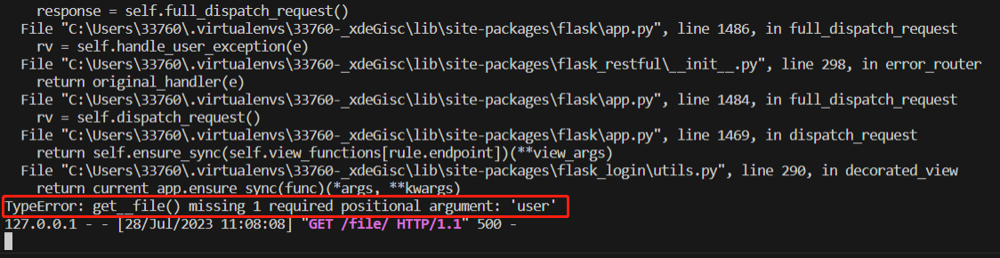

# 中传放心传个人实验报告

**作者**：giobana

**负责内容**：*基于网页的文件上传加密与数字签名系统* 部分的初步构建、后期的代码订正

**项目仓库地址**：[夏季小学期实践](基于网页的文件上传加密与数字签名系统)

## 1.1 基于网页的文件上传加密与数字签名系统初步构建：

### 1.1.1 Models 架构设计：

*相关引用：*

```python
# -*- coding: UTF-8 -*-
from sqlalchemy import Column, String, Integer, Boolean, ForeignKey, and_
from os import remove, path, mkdir
import re
from pathlib import *
import cv2

from app.extensions import db
from app.extensions import bcrypt
from app.user.models import User,UserRole
import enum
from flask import current_app
```

- 1、首先在 db.Model 类（一个 SQLAlchemy 库中的基类，用于定义数据库模型）的基础上定义 File 类，以及四个属性： creator_id （发布文件者id）、 filename （文件名）、 hash_value （哈希值）和 shared （共享文件）。其中 creator_id 和 filename 做主键标识该类中的每一行。

```python
class File(db.Model):
    __tablename__ = 'files'
    __table_args__ = {'mysql_collate': 'utf8_general_ci'}
    creator_id = db.Column(db.Integer, db.ForeignKey('users.id', ondelete='CASCADE'), primary_key=True)
    filename = db.Column(db.String(64), primary_key=True)
    hash_value = db.Column(db.String(128))
    shared = db.Column(db.Boolean, default=False)

```

*后续组长添加了唯一约束，替代之前的复合主键 ForeignKey ：*

```python
    __unique_constraint__ = (creator_id, filename)
```

- 2、在 File 中创建函数 upload_file ，对上传的文件进行辨别、限制和加密存储：

```python
    @classmethod
    ## 对上传的文件做限制
    def upload_file(cls, userid, data):
        from hashlib import sha512
        filename = data.filename
        filename_suffix = filename.split(".")[1]
        allowed_file_suffix_list = {'doc', 'docx', 'ppt', 'pptx', 'xls', 'xlsx', 'png', 'jpg', 'jpeg', 'gif'} ## 对文件类型进行限制
        if not filename_suffix  in allowed_file_suffix_list:
           print("禁止上传该类型的文件（应上传office文档，或允许的图片类型文件")
        f = File.query.filter(and_(File.creator_id == userid, File.filename == filename)).first()
        assert not f, '该文件已存在'  ## 若文件已存在，则提示
        content = data.read()
        assert len(content) < 10*1024*1024, '文件过大 (应小于10MB)' ## 文件大小限制在10MB以下
        user_id = str(user.id)+'/'
        if not path.exists(storage_path + user_id):
            if not path.exists(storage_path):
                mkdir(storage_path)
            mkdir(storage_path + user_id) ## 若文件是新上传的，则添加文件存储路径
            
            ## 对文件进行对称加密存储到文件系统，禁止明文存储文件
        # 计算原文件的哈希
        hash_value = sha512(content).hexdigest()
        # 判断文件是否存在
        if not path.exists(path + user_id + hash_value):
            # 加密并存储，对称密钥最初是由网页公钥加密后存储的，所以加密前得先还原出对称密钥。
            content = secret.symmetric_encrypt(secret.decrypt(user.encrypted_symmetric_key), content)
            # 同时计算签名
            signature = secret.sign(content)
            # 保存密文与签名
            with open(storage_path + user_id + hash_value, 'wb') as f:
                f.write(content)
            with open(storage_path + user_id + hash_value+'.sig', 'wb') as f:
                f.write(signature)
        creator_id = user.id
        file = File(creator_id=creator_id, filename=filename, hash_value=hash_value)
        db.session.add(file)
        db.session.commit()
```

*其中的 allowed_file_suffix_list 后续在组长的建议下调整成为 config.py 中的一个集合。*

- 3、在 File 中创建函数 delete_file ，实现删除已上传文件的功能：

```python
 @classmethod
    def delete_file(cls, user, filename):
        f = File.query.filter(and_(File.creator_id == user.id, File.filename == filename)).first()
        assert f, 'no such file ({})'.format(filename)
        hash_value = f.hash_value
        db.session.delete(f)
        db.session.commit()
        files = File.query.filter(File.hash_value == hash_value).all()
        if not len(files):
            remove(storage_path + str(user.id) + '/' + hash_value)
            remove(storage_path + str(user.id) + '/' + hash_value+'.sig')
```

- 4、在 File 中创建函数 download_file ，实现用户下载已上传文件的功能：

```python
@classmethod
    def download_file(cls, user, filename, type_):
        from flask import make_response
        f = File.query.filter(and_(File.creator_id == user.id, File.filename == filename)).first()
        assert f, 'no such file ({})'.format(filename)
        hash_value = f.hash_value
        if type_ == 'hashvalue':
            content = hash_value
            filename = filename + '.hash'
        elif type_ == 'signature':
            # 读取签名
            with open(storage_path+str(user.id)+'/'+hash_value+'.sig', 'rb') as f_:
                content = f_.read()
                filename = filename+'.sig'
        else:
            # 读取密文
            with open(storage_path+str(user.id)+'/'+hash_value, 'rb') as f_:
                content = f_.read()
            if type_ == 'plaintext':
                content = app.secret.symmetric_decrypt(app.secret.decrypt(user.encrypted_symmetric_key), content)
            elif type_ == 'encrypted':
                filename = filename + '.encrypted'
        response = make_response(content)
        response.headers['Content-Disposition'] = 'attachment; filename={}'.format(filename)
        return response
```

- 5、在 File 中创建函数 share_file ，实现用户分享自己已上传文件的功能：

```python
    @classmethod
    def share_file(cls, user, filename):
        f = File.query.filter(and_(File.creator_id == user.id, File.filename == filename)).first()
        assert f, 'no such file ({})'.format(filename)
        f.shared = not f.shared
        db.session.commit()
```

### 1.1.2 Views 路由设置：

- 相关引用：

```python
from flask import Blueprint, render_template, flash, redirect, request
from app.user.models import User,UserRole
from app.extensions import db
from flask_login import login_required
from app.blueprints import files
from app.file.models import File
from app.files.forms import FileForm
from app.extensions import login_manager
```

- 1、文件页面后端初步设计：

```python
@files.route('/')
@login_required
def get__file(user):
    files = File.query.filter(File.creator_id == user.id).all()
    return render_template('file.html',username=current_user.name, files=files)
```

- 2、文件上传请求发送部分：

```python
@files.route('/upload')
@login_required
def get__upload():
    return render_template('files/upload.html', form=FileForm()) ## 链接到上传文件页面
```

- 3、文件上传请求回馈部分：

```python
@files.route('/upload', methods=['POST'])
@login_required
def post__upload(user):
    try:
        from app.file.forms import FileForm
        form = FileForm()
        user_id = post__register
        assert form.validate_on_submit(), 'invalid form fields'
        data = form.file.data
        File.upload_file(user_id, data)
        flash('上传成功！')
    except AssertionError as e:
        message = e.args[0] if len(e.args) else str(e)
        flash('上传失败！'+message)
    return redirect('/files')
```

- 4、文件删除：

```python
@files.route('/remove')
@login_required
def get__remove(user):
    try:
        user_id = post__register
        filename = request.args.get('filename')
        assert filename, 'missing filename'
        File.delete_file(user_id, filename)
        flash('删除成功！')
    except AssertionError as e:
        message = e.args[0] if len(e.args) else str(e)
        flash('删除失败！'+message)
    return redirect('/files')
```

- 5、文件下载：

```python
@files.route('/download')
@login_required
def get__download(user):
    try:
        user_id = post__register
        filename = request.args.get('filename')
        assert filename, 'missing filename'
        type_ = request.args.get('type')
        assert type_, 'missing type'
        assert type_ in ('encrypted', 'plaintext', 'signature', 'hashvalue'), 'unknown type'
        return File.download_file(user_id, filename, type_)
    except AssertionError as e:
        message = e.args[0] if len(e.args) else str(e)
        flash('下载失败！'+message)
        return redirect('/files')
```

- 6、文件分享：

```python
@files.route('/download')
@login_required
def get__download(user):
    try:
        user_id = post__register
        filename = request.args.get('filename')
        assert filename, 'missing filename'
        type_ = request.args.get('type')
        assert type_, 'missing type'
        assert type_ in ('encrypted', 'plaintext', 'signature', 'hashvalue'), 'unknown type'
        return File.download_file(user_id, filename, type_)
    except AssertionError as e:
        message = e.args[0] if len(e.args) else str(e)
        flash('下载失败！'+message)
        return redirect('/files')
```

### 1.1.3 Forms 设置：

```python
from flask_wtf import FlaskForm
from wtforms import StringField, PasswordField, FileField
from wtforms.validators import DataRequired


class FileForm(FlaskForm):
    from flask_wtf.file import FileRequired
    file = FileField('file', validators=[FileRequired()])
```

*允许并确保用户上传了文件*

### 1.1.4 后期代码订正：

- 限制文件大小从 1MB 修改到 10MB ：

```python
assert len(content) < 10*1024*1024, '文件过大 (应小于10MB)' 
```

## 1.2 相关问题：

### 1.2.1 路由名设置不清导致的前后端链接不正确：

- 最开始设置路由名时，先在 Blueprint 蓝图中添加文件相关设置，添加如下：

```python
file = Blueprint('file', 'app.file.views', url_prefix='/file')
```

- 于是在运行网页并从 home.html 跳转到 file.html 的时候，会报错，无法找到名为 file 的 table name ，之后和大家讨论得知，**file 是 pyhton 内置环境中已有的默认类的名称，在此处直接用 file 定义我们的类就会导致系统识别错误**，于是将类名改为 files ：

```python
files = Blueprint('files', 'app.files.views', url_prefix='/files')
```

### 1.2.2 路由函数设定的参数无法传入问题：

- 最开始参考源代码，在文件的 views 设置里，文件页面跳转的函数都要传入参数 uesr ,如， file.html 跳转设置：

```python
@files.route('/')
@login_required
def get__file(user):
    files = File.query.filter(File.creator_id == user.id).all()
    return render_template('file.html',username=user.name, files=files)
```
- 于是在运行网页并从 home.html 跳转到 file.html 的时候，会报错： File.creator_id == user.id 命令无法实现， user.id 参数无法找到：



- 之后在排错的时候发现是因为数据库那边相关的存储问题，导致用户登录的时候，信息未被录入数据库中，所以在此传参会失败。所以后来直接去掉了该参数，改用 flask_login.utils.current_user 中录入的用户 id 来为 File.creator_id 赋值，即：

```python
@files.route('/')
@login_required
from flask_login import LoginManager, login_required, login_user, logout_user,current_user
def get__file(user):
    files = File.query.filter(File.creator_id == current_user.id).all()
    return render_template('file.html',username=current_user.name, files=files)
```
- 之后的调用就没有再出现问题。

### 1.2.3 文件路径存储问题：

- 最开始很头疼上传之后的文件路径存储，首先想到的是用 Pathlib 库中的 Path 及相关函数，但是相关函数的调用和实现略有繁琐，使用未果。后来组长提出在总目录下的 config.py 文件中定义 storage_path 用作文件的存储路径：

```python
basedir = os.path.abspath(os.path.dirname(__file__))
nacl_sk_path = "./certtest/privateKey.pem"
storage_path = "./storage"
```
- 这样，在后续涉及到文件路径相关的部分直接使用 storage_path 即可，十分便捷。

## 1.3 总结：

- 本次小组作业中的后端开发对我而言是一次全新的尝试和比较困难的挑战，因为之前极少接触后端开发，很多相关知识甚至没有了解和掌握，初期编码部分可谓是举步维艰。后来组内成员的鼓励帮助下，通过查阅相关资料、参考优质源码，逐步加深了对路由、修饰器、前后端链接等的认识，多次dbug之后终于完成了实验该部分的代码编译和结果呈现。
还感谢小组成员的鼓励与陪伴，**特别是组长在当时dbug多次未成之后力挽狂澜，解决了困扰我两天的问题，终于为第二部分的开发画上了圆满句号，保证项目进度正常进行**。希望今后能以她为榜样，继续学习和精进相关技能。

## 1.4 参考链接：

[python 限制文件格式](https://blog.csdn.net/daponi/article/details/100532615#:~:text=input%E7%9A%84type%3Dfile%E4%B8%8A%E4%BC%A0%E6%96%87%E4%BB%B6accept%E4%B8%AD%E9%99%90%E5%88%B6%E6%96%87%E4%BB%B6%E7%B1%BB%E5%9E%8Bpdf%E3%80%81doc%E3%80%81docx%E3%80%81%20jpg%E3%80%81,png%E3%80%81xls%20%E3%80%81xlsx%E7%AD%89%E6%A0%BC%E5%BC%8F)

[office文件类型](https://learn.microsoft.com/zh-cn/deployoffice/compat/office-file-format-reference)

[参考代码](https://learn.microsoft.com/zh-cn/deployoffice/compat/office-file-format-reference)