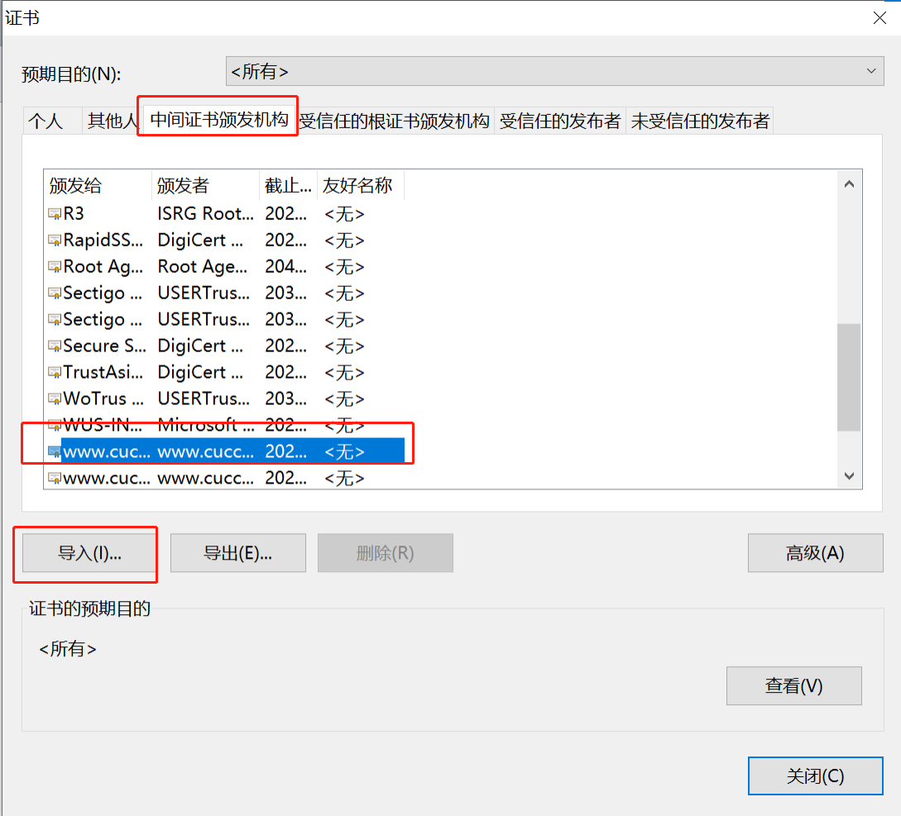
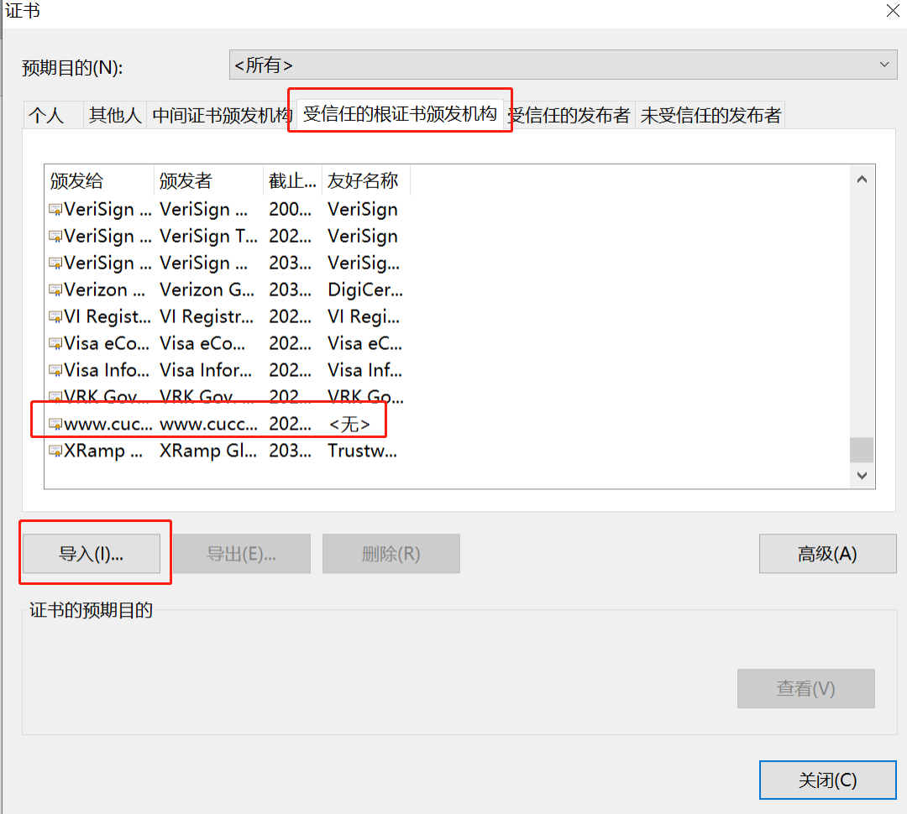

# 中传放心传
本项目是 [中国传媒大学密码学应用实践课程](https://c4pr1c3.github.io/cuc-wiki/ac.html) 十二点前不起床小组的结课项目。

附上[仓库链接](https://github.com/kalumasan/Cryptography_Practice)
## 功能清单 
  - 基于网页的用户注册与登录系
    - [x] 使用 https 绑定证书到域名而非 IP 地址 【 *PKI* *X.509* 】
      - 用户名的合法字符集范围：中文、英文字母、数字
        - 类似：-、_、.等合法字符集范围之外的字符不允许使用
      - 用户口令长度限制在36个字符之内
      - 对用户输入的口令进行强度校验，禁止使用弱口令
    - [x] 使用合法用户名和口令登录系统
    - [x] 禁止使用明文存储用户口令 【 PBKDF2 散列算法 慢速散列 针对散列算法（如MD5、SHA1等）的攻击方法 】
      - 存储的口令即使被公开，也无法还原/解码出原始明文口令
    - [x] （可选）安全的忘记口令 / 找回密码功能
    - [x] （可选）微信/微博/支付宝的OAuth授权登录 / 注册绑定
    - [x] （可选）双因素认证
      - OTP: Google Authenticator
      - Email
      - SMS
      - 扫码登录
  - 基于网页的文件上传加密与数字签名系统

    - [x] 已完成《基于网页的用户注册与登录系统》所有要求
    - [x] 限制文件大小：小于 10MB
    - [x] 限制文件类型：office文档、常见图片类型
    - [x] 匿名用户禁止上传文件
    - [x] 对文件进行对称加密存储到文件系统，禁止明文存储文件 【 对称加密 密钥管理（如何安全存储对称加密密钥） 对称加密密文的PADDING问题 】
    - [x] 系统对加密后文件进行数字签名 【 数字签名（多种签名工作模式差异 ）】
  - 基于网页的加密文件下载与解密
    - [x] 已完成《基于网页的文件上传加密与数字签名系统》所有要求
    - [x] 提供匿名用户加密后文件和关联的数字签名文件的下载
      - 客户端对下载后的文件进行数字签名验证 【 非对称（公钥）加密 数字签名 】
      - 客户端对下载后的文件可以解密还原到原始文件 【 对称解密 密钥管理 】
    - [x] 提供已登录用户解密后文件下载
    - [x] 下载URL设置有效期（限制时间或限制下载次数），过期后禁止访问 【 *数字签名 消息认证码 Hash Extension Length Attack Hash算法与HMAC算法的区别与联系* 】
    - [x] 提供静态文件的散列值下载，供下载文件完成后本地校验文件完整性 【 散列算法 】
    
## 本项目用到的关键技术
* 前端:HTML CSS JavaScript Bootstrap
* 后端：Flask Python3.10
* 数据库：SQLAlchemy
### 密码学理论与技术示范应用要点说明
| 密码学理论   | 技术应用 |   技术示范 |作用|
| :------------- | :----------: | :----------: | :----------: |
|哈希+数字签名|x.509证书|配置https|识别网页身份，保护数据传输安全|
|哈希 | bcrypt | 用户口令加密存储 |保证用户密码安全性|
|哈希函数+哈希摘要 |hashlib|找回密码验证码安全传输和检验| 保证验证码的安全性和有效性  |
|  对称密钥|   nacl.secret   |  加密文件 | 存储加密文件防止明文被获取 |
| 非对称密钥  |    nacl.signing   | 数字签名|系统对上传的加密文件签名，用户下载的时候验证签名|
|哈希摘要|hashlib|生成文件哈希值|验证下载的明文是否经过篡改（验证完整性和唯一性）|


## 快速上手体验
- 项目核心代码：项目核心部分存放于`仓库根目录/example/`内
- 项目必要依赖存放在`requirements.txt`内，基于python3.10
- 快速上手：
将本项目git clone（或者下载zip包）到本地后，使用vscode打开，通过shell切换到example分支。
```python
#当前目录为仓库根目录
pip install -r requirements.txt
# 初始化数据库
flask db init
# 生成迁移文件
flask db migrate
# 迁移数据库，即创建database以及各个表
flask db upgrade
# 运行站点
set FLASK_RUN_CERT=cert\selfsignedCertificate.pem
set FLASK_RUN_KEY=cert\privateKey.pem
flask run --host=www.cuccloud.getuplate.com --port=443 --cert=cert\selfsignedCertificate.pem --key=cert\privateKey.pem
```
打开浏览器访问：https://www.cucloud.getuplate.com 即可快速体验系统的所有功能
### 依赖环境配置补充说明
- 配置域名
在本地修改hosts文件，添加`127.0.0.1 www.cuccloud.getuplate.com`的映射
Windows环境中，文件位于`C:\Windows\System32\drivers\etc`
- 证书安装
因为我们的证书使用的是自签名证书，需要在浏览器的管理证书的cert目录下将www.cuccloud.getuplate.com.crt证书添加到浏览器受信用的根证书，中间证书颁发机构列表中。


## 演示
[查看演示视频]()
